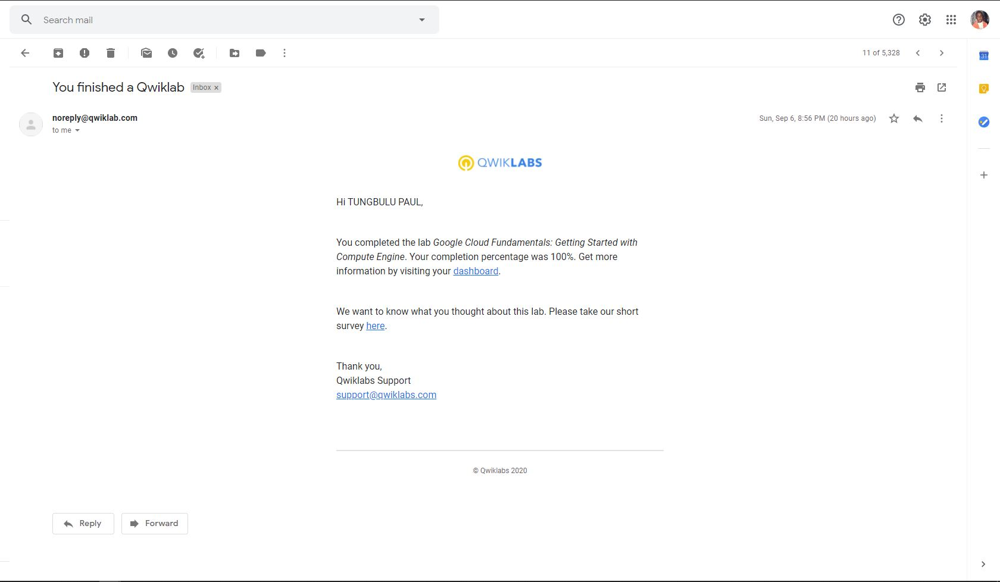
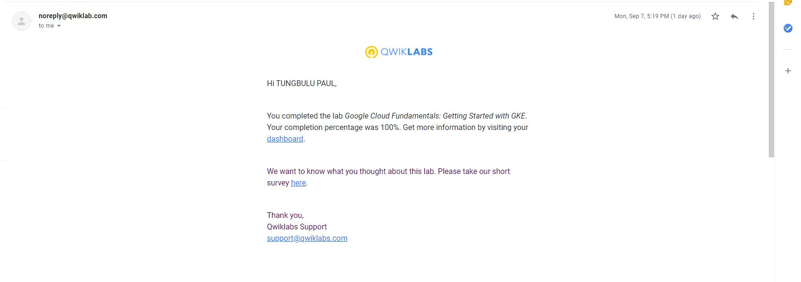

<!-- Change title below -->

# gads-2020-project-submission

## QwikLabs Completed

<details>
  <!-- The complete lab title goes here 👇🏾-->
  <summary>Lab 1: Google Cloud Fundamentals: Getting Started with Compute Engine
</summary>
  <!-- Provide path to the screenshot here. Example 👇🏾-->
  
</details>

<details>
  <!-- The complete lab title goes here 👇🏾-->
  <summary>Lab 2: Google Cloud Fundamentals: Getting started with GKE</summary>
  <!-- Provide path to the screenshot here. Example 👇🏾-->
  
</details>

## Translation code

```
# LAB 1: Google Cloud Fundamentals: Getting Started with Compute Engine

## Objectives:
In this lab, you will learn how to perform the following tasks:
    - Create a Compute Engine virtual machine using the Google Cloud Platform (GCP) Console.
    - Create a Compute Engine virtual machine using the gcloud command-line interface.
    - Connect between the two instances.
##Steps:

1. Create a Compute Engine virtual machine using the GCP Console.
      gcloud compute instances create my-vm-1 --machine-type "n1-standard-1" --image-project "debian-cloud" --image "debian-9-strech-v20198213" --subnet "default" --tags http
      
      gcloud compute firewall-rules create allow-http --action=ALLOW --destination=INGRESS --rules=http:80 --target-tags=http
      
      
2. Create a virtual machine using the gcloud command line.
   1. Choose a zone from the output of this region and use the grep command to filter the results associated with us-central1           region:
   
      gcloud compute zones list | grep us-central1
      
   2. After choosing a zone other than the one assigned to you, create the virtual machine:
   
      gcloud config set compute/zone us-central1-b
      gcloud compute instances create "my-vm-2" --machine-type "n1-standard-1" --image-project "debian-cloud" --image "debian-9-stretch-v20190213" --subnet "default"
      
3. Connect between the two virtual machine instances.
    
    1. Use the ping command to confirm that my-vm-2 can reach my-vm-1 over the network
      - Connect to my-vm-2:
            gcloud compute ssh my-vm-2
      - ping my-vm-1 from my-vm-2:
            ping -c 4 my-vm-1
      - Use the ssh command to open a command prompt on my-vm-1 from my-mv-2:
            ssh my-vm-1
      - At the command prompt on my-vm-1, install the Nginx web server:
            sudo apt-get install nginx-light -y
      - Use the nano text editor to add a custom message to the home page of the web server:
            sudo nano /var/www/html/index.nginx-debian.html
      - Use teh arrow keys to move the cursor to the line just below the h1 header. Add text like this, and replace YOUR_NAME with your name:
            Hi from Tungbulu
      - Hit Ctrl+O then press Enter to save, Press Ctrl+X to exit editor
      - Confirm that the web server is serving your new page. At the command prompt on vm-vm-1, execute this command:
            curl http://localhost/
          - Result:
                - The response will be the HTML source of the web server's home page, including your line of custom text.
      - To exit the command prompt on my-vm-1, execute this command:
            exit
      - To confirm that my-vm-2 can reach the web server on my-vm-1, at the command prompt on my-vm-2, execute this command:
            curl http://my-vm-1/
          - Result: The response will again be the HTML source of the web server's home page, including your line of custom text
     2. Now get the external IP of the my-vm-1 instances from this command:
            gcloud compute instances list --zone us-central1-a
     3. Paste the copied IP address of my-vm-1 into a new browser tab and hit enter. 
     
          - Result: You will see your your web server's homepage, including custom text
          
          
          
# LAB 2: Google Cloud Fundamentals: Getting Started with GKE

## Objectives:
In this lab, you will learn how to perform the following tasks:
     - Provision a Kubernetes cluster using Kubernetes Engine.
     - Deploy and manage Docker containers using kubectl.
     
##Steps:
      - Go to Navigation Menu and Click API & Services  and confirm if Kubernetes Engine API and Container Registry API are enabled, if not enable them.
      
1. Provision  a Kubernetes Engine      
      - Export your zone into an environment variable called MY_ZONE:
            export MY_ZONE=us-central1-a
      - Start a Kubernetes cluster managed by Kubernetes Engine. Name the cluster webfrontend and configure it to run 2 nodes:
            gcloud container clusters create webfrontend --zone $MY_ZONE --num-nodes 2
      - Check your installed version of Kubernetes using the kubectl version command:
            kubectl version
2. Deploy and manage Docker containers using kubectl
      - launch a single instance of the nginx container:
            kubectl create deploy nginx --image=nginx:1.17.10
      - View the pod running the nginx container:
            kubectl get pods
      - Expose the nginx container to the Internet:
             kubectl expose deployment nginx --port 80 --type LoadBalancer
      - View the new service:
             kubectl get services
             
            -Open a new web browser tab and paste your cluster's external IP address into the address bar. The default home page                of the Nginx browser is displayed.
            
      - Scale up the number of pods running on your service:
             kubectl scale deployment nginx --replicas 3
      - Confirm that Kubernetes has updated the number of pods:
             kubectl get pods
      - Confirm that your external IP address has not changed:
             kubectl get services
             
             - Return to the web browser tab in which you viewed your cluster's external IP address. Refresh the page to confirm                  that the nginx web server is still responding.
```
